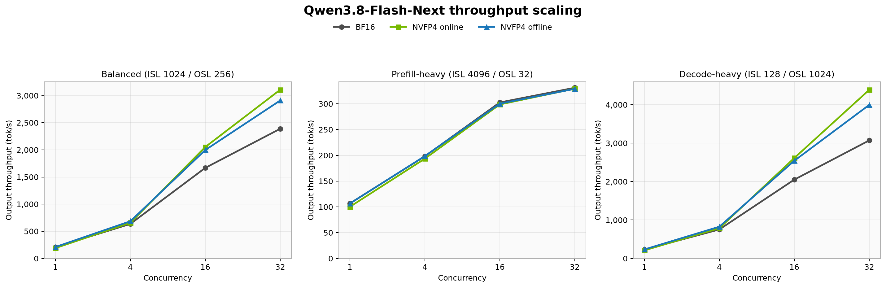
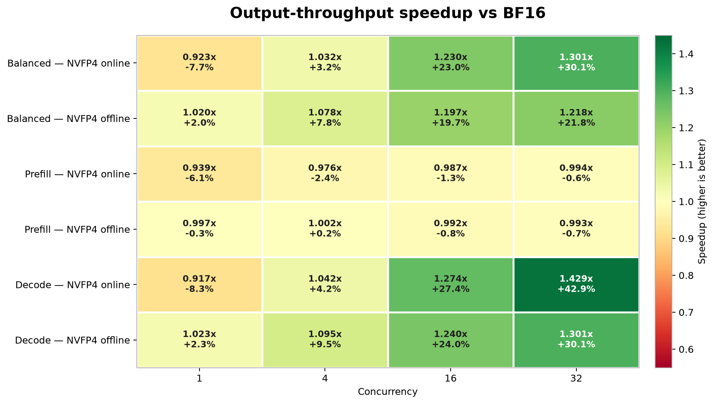
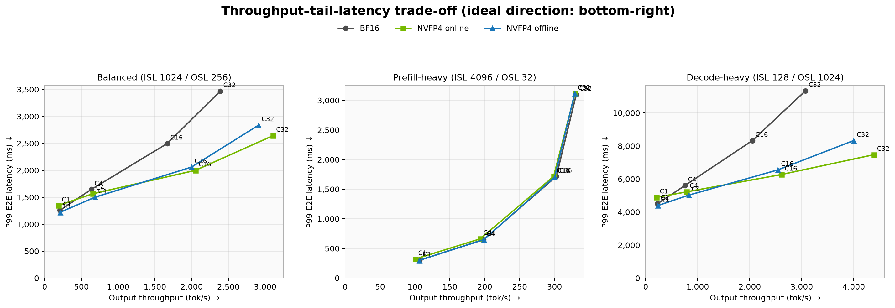
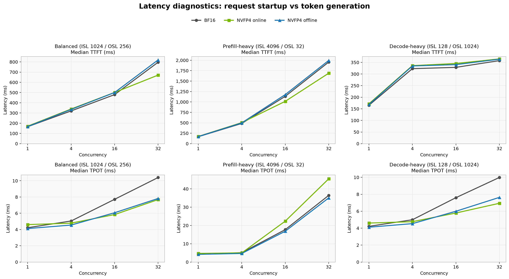
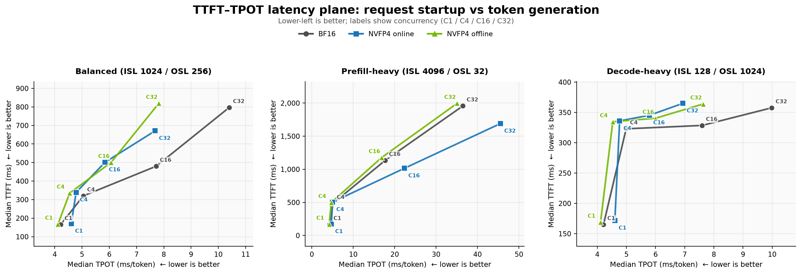

# Qwen3.8-Flash-Next 性能可视化

数据来源：`summary.md` / `summary.csv`；每个结果为 3 次运行的中位数。

## 1. 吞吐随并发扩展

## 2. 相对 BF16 的吞吐提升

## 3. 吞吐与尾延迟权衡

越靠近右下角，代表吞吐越高且 P99 端到端延迟越低。

- 横轴是 Output throughput，越靠右吞吐越高。
- 纵轴是 P99 E2E latency，越靠下尾延迟越低。
- 点表示不同并发数，同色连线表示同一种精度模式的并发扫描，而不是时间序列。
- 应在同一个 workload 面板内比较；不同 ISL/OSL 的 workload 不宜直接比较绝对位置。

这张图回答的是“提高吞吐时付出了多少尾延迟”，并同时覆盖排队、prefill 和 decode 阶段。

## 4. 延迟来源诊断

上排是 median TTFT，下排是 median TPOT；三列分别对应 Balanced、Prefill-heavy 和 Decode-heavy。

- TTFT 表示从发出请求到收到首 token 的时间，主要受排队、prefill 和首次调度影响。
- TPOT 表示首 token 之后生成每个输出 token 的平均时间，主要反映 decode 节奏。
- 两项指标均越低越好；这里展示中位数，不能替代图 3 的 P99 尾延迟视角。

## 5. TTFT–TPOT 延迟权衡平面

横轴是 median TPOT，纵轴是 median TTFT，越靠近左下角越好。每条线按 `C1 → C4 → C16 → C32` 连接同一种精度模式的测试点。

三个 workload 使用各自独立的坐标范围，所以应在单个面板内比较模式。图中的 X/Y 是分别聚合得到的中位数，不代表单个请求层面的 TTFT–TPOT 相关性；连线表示并发扫描，不是时间序列。

## 关键结论

- Decode C=32：online 吞吐 +42.9%，P99 E2E -34.1%；offline 吞吐 +30.1%，P99 E2E -26.6%。
- Balanced C=32：online 吞吐 +30.1%，offline +21.8%。
- Prefill C=32：online 吞吐 -0.6%，offline -0.7%，可视为基本持平。
- Balanced/Decode：offline 在低并发更好；online 在 C=16/32 扩展性更强。
- NVFP4 offline 在全部 12 个测试点上 TPOT 都低于 BF16，但 TTFT 略高，体现“首 token 略慢、后续 token 更快”的稳定权衡。
- Balanced C=32：online 同时降低 TTFT（796.6 → 671.1 ms）和 TPOT（10.40 → 7.68 ms）。
- Decode C=32：online 的 TPOT 降低 30.5%，但 TTFT 增加约 2.1%；Prefill C=32 则是 TTFT 降低 13.6%、TPOT 增加 24.9%。
- 只有 3 次运行的中位数，源数据未提供离散度；图中不添加误差棒，约 1–2% 的差异应视为近似持平。
